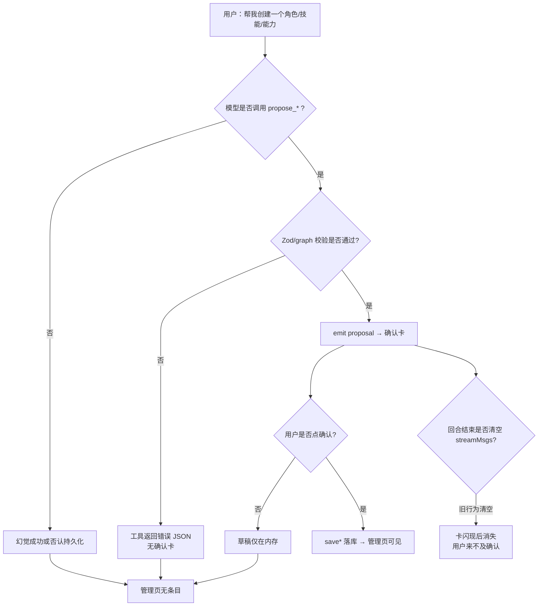
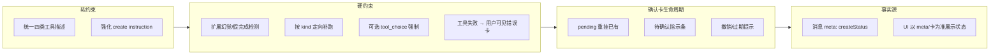

# 聊天创建入库根治方案（角色 / 能力 / 技能 / 人设）

> **状态**：已确认 · A 全部 + B1/B2/B4 已落地（C 期延后）  
> **日期**：2026-08-07  
> **范围**：首页主助手经对话创建/修改四类资产：Agent（角色）、Capability（能力）、Skill（技能）、Persona（人设）  
> **相关代码**：`tools/builtin/create.ts` · `ipc/home.ts` · `orchestrator/home.ts` · `CreateConfirmCard.tsx` · `HomePage.tsx`  
> **关联铁律**：确认入库才入库；工具失败返回错误 JSON 不抛（铁律 11）；i18n T2（主进程不对用户硬编码中文报错优先走 key）

> 🔍 **Review 汇总（2026-08-07）**：已逐条对照代码验证，根因分析与方案设计均准确合理。以下 5 条建议已嵌入对应章节：  
> - **R1**（A3）：kind 推断用关键词匹配表，不引入额外 LLM 分类  
> - **R2**（A4）：失败卡与补跑重试两者都做，卡内提供「重试」按钮  
> - **R3**（A5）：`confirmCreate` 须补写 `meta.create.status=confirmed`，否则 B 期降级误报  
> - **R4**（B4）：补跑文案改 kind 措辞时须同步走 i18n key，不搬位置继续硬编码  
> - **R5**（§九）：DoD 补第 7 条——文案按 kind 措辞 + i18n key 覆盖

---

## 一、问题陈述

### 1.1 用户可见症状

1. 主助手在对话里宣称「✅ 正式创建成功 / 已入库」，但角色/技能/能力管理页没有对应条目。  
2. 用户追问后，主助手承认「只是模拟」「对话环境没有持久化」——与产品真实能力矛盾。  
3. 创建过程中**没有弹出确认卡**，用户无法点「确认入库」。  
4. 角色问题暴露后已部分缓解；**技能与能力同源架构，风险同等甚至更高**（能力需合法 graph，更容易「嘴上成功、工具失败」）。

### 1.2 产品契约（设计意图）

```
用户意图（创建角色/能力/技能/改人设）
  → 主 Agent 澄清需求
  → 调用 propose_* 工具（只产草稿，不落库）
  → 前端弹出 CreateConfirmCard（可编辑）
  → 用户点「确认入库」
  → home:confirmCreate → saveAgent / saveCapability / saveSkill / savePersona
  → 管理页可见
```

**唯一合法入库路径**是用户确认。口头「已入库」≠ 系统写库。

### 1.3 为何这是「根」问题而非单一 bug

表层是「没弹窗 / 列表没有」；根因是 **意图执行链路缺少硬约束**：模型可绕过工具、工具失败可被忽略、确认卡生命周期脆弱、成功语义可被幻觉占用。需要分层根治，而不是只加一句 prompt。

---

## 二、根因分析（分层）



### 2.1 L1 — 模型未调用 `propose_*`（主因）

| 因素 | 说明 |
|------|------|
| 工具可选 | Anthropic tool-use 默认不强制；模型可纯文本「扮演」创建完成 |
| 指令可被忽视 | `buildCreateInstruction` 已写「确认才入库」，模型仍宣称成功或「无持久化」 |
| 工具描述不齐 | `propose_agent` 已加强「勿宣称创建成功」；`propose_skill` / `propose_capability` 仍偏软 |
| 能力/技能成本高 | 能力要合法 `graph`、技能要长 `content`，模型倾向在聊天里「演示」而不是调工具 |

### 2.2 L2 — 调用了工具但未产生确认卡

| 因素 | 说明 |
|------|------|
| `propose_capability` Zod | `graph.nodes` 最少 1 个；非法 graph → `invalid_args`，**不触发** `onPropose` |
| `onPropose` 未注入 | 理论返回 ok 但不推前端（单测已覆盖）；首页路径已注入，非主因 |
| 工具名冲突/未注册 | 启动时 `registerCreateTools()`；若日志出现 `propose_* 工具:（无！）` 即为注册故障 |

### 2.3 L3 — 确认卡出现但未能完成确认（已部分修复）

| 因素 | 旧行为 | 现状 |
|------|--------|------|
| 回合结束 `setStreamMsgs([])` | 未确认卡被清空 | 已用 `listPendingDrafts` + `sessionId` 重挂 |
| 草稿无会话归属 | 切会话串卡/丢卡 | 草稿打 `sessionId` |
| 草稿仅内存 | 进程退出丢失 | **仍在**（可接受 MVP；见方案 F） |

### 2.4 L4 — 成功语义失控

| 因素 | 说明 |
|------|------|
| 无「事实源」 | UI/历史以模型正文为准，不以「是否 propose / 是否 confirm」为准 |
| 补跑文案角色偏见 | 强制补跑提示写「角色库」，技能/能力场景误导，且可能诱导向 `propose_agent` |
| 幻觉检测词表偏窄 | `needsCreateRecovery` 抓「已入库/创建成功/没有持久化」；漏掉「已配好/技能已添加/工作流就绪」等 |

### 2.5 四类资产风险对照

| 维度 | 角色 Agent | 技能 Skill | 能力 Capability | 人设 Persona |
|------|------------|------------|-----------------|--------------|
| 工具 | `propose_agent` | `propose_skill` | `propose_capability` | `propose_persona` |
| 载荷难度 | 中（instructions） | 高（长 content） | **很高（合法 graph）** | 中 |
| 校验失败无卡 | 少 | 少 | **多** | 空载荷守卫 |
| 工具描述防幻觉 | 已加强 | **弱** | **弱** | 中 |
| 幻觉补跑覆盖 | 有 | 文案同路径但提示偏「角色」 | 同左 | 同左 |
| 管理页 | `/agents` | `/skills` | 能力列表/画布 | 设置人设 |

---

## 三、已落地缓解（勿重复造）

| 项 | 位置 | 作用 | 局限 |
|----|------|------|------|
| 确认才入库 | `create.ts` / `home:confirmCreate` | 设计正确 | 不阻止模型嘴硬 |
| 创建指令 + 严禁幻觉段 | `buildCreateInstruction` | 降低幻觉 | 软约束 |
| 草稿 `sessionId` + `listPendingDrafts` | `ipc/home` + `HomePage` | 防卡被清空 | 不解决「从未 propose」 |
| `needsCreateRecovery` + 强制补跑 | `home.ts` / `ipc/home` | 抓典型幻觉后补 propose | 词表窄；提示写死「角色库」；补跑仍可能调错工具或 graph 再失败 |
| `propose_agent` 工具描述加强 | `create.ts` | 角色侧更硬 | skill/capability 未对齐 |

---

## 四、根治目标与原则

### 4.1 目标

1. **事实与话术一致**：未 `propose_*` 不得呈现「已创建/已入库」；未 `confirmCreate` 管理页必无新条目。  
2. **四类资产同等级防护**：角色 / 技能 / 能力 / 人设同一套硬约束，无「只修了角色」。  
3. **确认卡必达**：意图成熟或模型宣称完成时，用户一定能看到可点的确认卡（或明确的失败原因卡）。  
4. **失败可解释**：graph 非法、空载荷等 → 用户可见结构化失败，而不是静默无卡。  
5. **可观测**：主进程日志可区分「未调用 / 调用失败 / 已提案待确认 / 已入库」。

### 4.2 原则

| 原则 | 含义 |
|------|------|
| P1 工具是唯一提案入口 | 禁止「正文 JSON 当创建」；创建完成态只能来自 propose 事件 |
| P2 用户确认是唯一入库入口 | 保持现有 `confirmCreate`；不自动入库（防误写） |
| P3 硬约束优先于 prompt | prompt 保留；关键路径用检测 + 补跑 +（可选）tool_choice |
| P4 失败对用户可见 | 工具错误/补跑失败 → 聊天气泡或错误卡，不吞 |
| P5 四类对称 | 描述、检测、提示、失效缓存、测试用例四类对齐 |
| P6 最小惊讶 | 补跑提示按资产类型措辞；不诱导错工具 |

### 4.3 非目标（本方案不做）

- 取消确认卡、一键静默入库（安全与可编辑草稿价值保留）  
- 向量检索 / 云同步创建  
- 让模型在聊天里直接改管理页（绕过 propose）  
- Magentic / a2a 远程创建  

---

## 五、完整解决方案（分层设计）

### 5.0 总览



建议分三期交付：先齐硬约束与对称性（根治主因），再增强 UX 与可观测，最后可选 tool_choice / 草稿落盘。

---

### 5.1 A 期 — 对称硬约束（根治主因，优先做）

#### A1. 四类 `propose_*` 工具描述对齐

对 `propose_skill` / `propose_capability` / `propose_persona` 采用与 `propose_agent` 同级措辞：

- 调用本工具 = 仅弹出确认卡  
- **不等于已入库**  
- **禁止**向用户宣称创建成功 / 已保存 / 已入库  
- capability 额外强调：必须产出 **通过校验的 graph**；校验失败不会弹卡  

#### A2. 扩展 `needsCreateRecovery`（或升级为 `detectCreateHallucination`）

在现有正则基础上增加（示例，实现时单测锁定）：

| 类别 | 模式示例 |
|------|----------|
| 成功幻觉 | 已入库、创建成功、正式创建、已添加、已配好、已就绪、已经帮你建好 |
| 资产词（可选加权） | 角色/agent、技能/skill、能力/capability/工作流、人设 |
| 否认持久化 | 没有持久化、没有存储、只是模拟、无法保存到系统、对话环境中没有 |

注意避免误伤：「请在下方卡片中**确认入库**」不得触发补跑（保持现有负例）。

#### A3. 补跑按意图定向（防调错工具）

从「用户消息 + 助手正文 + 近几轮上下文」推断 `kind`：

| 推断 | 强制工具 |
|------|----------|
| 角色/agent | 仅 `propose_agent` |
| 技能/skill/SKILL.md | 仅 `propose_skill` |
| 能力/编排/工作流 | 仅 `propose_capability` |
| 人设/叫我/语种 | 仅 `propose_persona` |
| 无法判断 | 四类都挂，但 system 强制「只调与对话匹配的一个」 |

补跑提示文案改为中性或按 kind：

- ❌「尚未写入角色库」  
- ✅「尚未写入{角色/技能/能力/人设}库」

> 🔍 **Review 建议 R1（kind 推断算法）**：  
> 推断逻辑建议实现时用**关键词匹配表**（如上表所示的正则/包含判断），不要引入额外 LLM 分类调用——补跑本身已增加一次 LLM 调用，再叠加分类会显著增加延迟。匹配规则：  
> 1. 优先扫用户最近一条消息的关键词（角色/agent → agent；技能/skill/SKILL.md → skill；能力/编排/工作流 → capability；人设/叫我/语种 → persona）；  
> 2. 若用户消息无命中，扫助手正文中的资产词；  
> 3. 都无命中才走「四类都挂」兜底。  
> 单测需覆盖正反例（如用户说「帮我建一个工作流」→ capability，不说「角色」→ 不误判 agent）。

#### A4. 工具失败对用户可见（尤其 capability）

当 `propose_*` 返回 `isError` / `invalid_args` / graph 校验失败：

1. 主进程 `emitStream` 新增事件，例如：  
   `{ type: 'proposal_error', kind, error, detail }`  
2. 前端渲染「创建失败」卡：展示可读原因（graph 缺节点、字段缺失等）+「让助手重试」提示  
3. 避免仅模型内部看到错误 JSON、用户侧无卡无提示  

> 🔍 **Review 建议 R2（失败卡与补跑重试的边界）**：  
> 建议失败卡与补跑重试**两者都做**，而非二选一：  
> 1. 先出 `proposal_error` 失败卡（用户可见错误原因）；  
> 2. 卡内提供「让助手重试」按钮，点击后触发 A3 定向补跑（按 kind 挂对应 `propose_*`）；  
> 3. 补跑成功 → 替换为正常确认卡；补跑仍失败 → 更新失败卡或推送兜底气泡（B2）。  
> 这样既不吞错误（用户始终有反馈），也给用户操作出口（不是只能干等）。

#### A5. 创建状态事实源（轻量）

`addMessage` 的 assistant `meta` 增加可选字段：

```ts
meta: {
  create?: {
    status: 'proposed' | 'confirmed' | 'failed' | 'hallucination_recovered'
    kind?: 'agent' | 'capability' | 'skill' | 'persona'
    draftId?: string
  }
}
```

- 弹出确认卡时：`proposed`  
- `confirmCreate` 成功：可再写一条系统提示或更新（MVP 可只打日志 + 卡状态）  
- 渲染层：若正文含「已入库」但 `meta.create` 不是 confirmed，可降级显示警告条（可选，B 期）

> 🔍 **Review 建议 R3（meta 写入时机需明确）**：  
> 当前 `confirmCreate` handler（`ipc/home.ts`）只做 `save*` + 删草稿，**不写消息 meta**。若 A5 要落地 `confirmed` 状态，需在 `confirmCreate` 成功后补一步：更新对应 assistant 消息的 `meta.create.status = 'confirmed'`（或追加一条系统消息标记入库完成）。  
> 否则 meta 只有 `proposed` 没有 `confirmed`，B 期 UI 降级（正文说「已入库」但 meta 未确认 → 警告条）会误报所有已确认的创建。  
> 实现建议：`confirmCreate` handler 内 `addMessage` 或新增 `updateMessageMeta` 方法。

#### A6. 单测与契约

| 用例 | 断言 |
|------|------|
| skill/capability 工具描述含「勿宣称创建成功」 | 字符串契约 |
| 幻觉文案「技能已添加」「能力已配好」→ recovery true | `needsCreateRecovery` |
| 「请确认入库」→ false | 负例 |
| kind 推断：用户说技能 → 补跑仅挂 `propose_skill` | 单测 |
| 非法 capability graph → `proposal_error` 事件（或等价） | IPC/工具测 |
| 确认后 `invalidateQueries` agents/skills/capabilities | 保持现有 |

---

### 5.2 B 期 — UX 与可观测（体验闭环）

#### B1. 待确认草稿指示条

会话内存在 `listPendingDrafts(sessionId)` 非空时，聊天顶部/底部固定条：

- 「有 N 个创建预览待确认」  
- 点击滚动到确认卡  

避免卡在视口外被当成「没弹窗」。

#### B2. 补跑失败兜底 UI

强制补跑后 `proposeCount` 仍为 0：

- 推送明确错误气泡（i18n key）：「助手未能生成确认卡，请重试或到管理页手动新建」  
- 提供快捷入口：角色/技能/能力页「新建」

#### B3. 日志与诊断

统一前缀 `[home:create]`：

```
propose tools registered: ...
propose invoked: kind= skill draftId=...
propose failed: kind=capability code=invalid_args
recovery triggered: kind=capability reason=hallucination
recovery done: proposed=1|0
confirmCreate: kind=... id=...
```

设置页或开发菜单可选「最近创建诊断」——MVP 可只写日志。

#### B4. i18n

补跑提示、失败卡、指示条全部走 `home:create.*` / `errors.create.*`，主进程返回 key + params，渲染层翻译（对齐铁律 T2）。

> 🔍 **Review 建议 R4（补跑文案 i18n 须同步 A3）**：  
> 当前 `ipc/home.ts` 第 448 行补跑提示硬编码中文 `尚未真正写入角色库`，违反铁律 T2。A3 改文案为按 kind 措辞时，**必须一并走 i18n key**（如 `home:create.recovery.pending.{kind}`），不要把中文搬个位置继续硬编码。  
> 同理 A4 失败卡的错误文案也应走 `errors.create.*` key。

---

### 5.3 C 期 — 加强强制与持久化（可选）

#### C1. API `tool_choice` 强制（能力允许时）

在补跑轮对 Anthropic 请求设置：

```ts
tool_choice: { type: 'tool', name: 'propose_skill' } // 按推断 kind
```

中转/非 Anthropic 协议需探测：不支持则回退「仅挂一个工具 + 强 system」。

#### C2. 草稿落盘

`pendingDrafts` 现为内存 Map（30min TTL）。可选：

- 写入 `userData/create-drafts.json`（`writeJsonAtomic`）  
- 启动恢复未确认卡  

进程崩溃后仍可确认；复杂度中等，可后置。

#### C3. 管理页「来自聊天的待确认」

角色/技能/能力页展示 pending 草稿入口，与聊天卡同源 `draftId`，避免只能在首页确认。

---

## 六、推荐实施顺序

| 阶段 | 内容 | 预估 | 验收 |
|------|------|------|------|
| **A** | A1–A6 对称描述 + 扩展检测 + 定向补跑 + 失败可见 + meta + 单测 | 1–2 日 | 技能/能力幻觉文案必出卡或失败卡；角色回归不破 |
| **B** | B1–B4 指示条 + 失败兜底 + 日志/i18n | 0.5–1 日 | 「没看见卡」可发现；日志可定位 |
| **C** | C1–C3 tool_choice / 落盘 / 管理页入口 | 按需 | 中转兼容验证后再开 |

**建议确认范围**：先做 **A 期全部**；B1/B2 强烈建议一并做（低成本高体感）；C 期单独立项。

---

## 七、关键流程（目标态）

### 7.1 正常创建（技能示例）

```
用户：帮我做一个「品牌文案规范」技能
主 Agent：澄清 → propose_skill
前端：CreateConfirmCard（content 可编辑）
用户：确认入库
saveSkill → invalidate skills → 技能页可见
正文仅允许：「预览已生成，请确认」；禁止「已入库」
```

### 7.2 幻觉路径（目标态）

```
主 Agent：正文「技能已添加」（未调工具）
检测：hallucination + kind=skill
提示：尚未写入技能库，正在生成确认卡
补跑：仅 propose_skill → 弹出确认卡
用户确认 → 技能页可见
```

### 7.3 能力 graph 失败（目标态）

```
propose_capability(非法 graph) → proposal_error 卡
文案：编排图校验失败（节点为空）… 可让助手重试
不出现「已入库」；管理页无条目
```

---

## 八、测试计划

### 8.1 自动化

- `needsCreateRecovery` / kind 推断：正负例表驱动  
- `create.ts`：四类工具描述契约；capability 非法 graph；skill/agent/persona 提案  
- `home` 补跑：mock Agent 第一轮幻觉、第二轮 propose → `proposeCount>=1`、事件含 `proposal`  
- 回归：TeamJsonDetector、确认入库 IPC、listPendingDrafts  

### 8.2 手工 E2E（确认 A 期后必做）

| # | 步骤 | 期望 |
|---|------|------|
| 1 | 「创建一个角色…」澄清后创建 | 出确认卡 → 确认 → 角色页有 |
| 2 | 「创建一个技能…」 | 同上 → 技能页有 |
| 3 | 「创建一个能力/工作流…」 | 出卡（含 graph 预览）→ 确认 → 能力列表有 |
| 4 | 诱导模型只说「已入库」不调工具 | 出现补跑提示 + 确认卡 |
| 5 | 能力给残缺需求导致坏 graph | 失败卡或补跑后仍失败的明确提示，无静默成功 |
| 6 | 出卡后不确认，发下一条消息 / 重进会话 | 待确认卡仍在 |
| 7 | 确认后看对应管理页 | 条目存在且名称正确 |

---

## 九、验收标准（DoD）

1. 四类资产均无法仅靠模型口头宣布而出现在管理页。  
2. 模型在未 propose 时宣称完成或否认持久化 → **自动补跑**且补跑工具集合与意图 kind 一致。  
3. propose 校验失败 → 用户可见失败信息，而非无卡无提示。  
4. 确认卡在回合结束、切回会话后仍可确认（已有能力保持）。  
5. 相关单测通过；`npm run typecheck` 通过。  
6. `task.md` 勾选本方案 A 期（及已做的 B 项）。  

> 🔍 **Review 建议 R5（补充 DoD 第 7 条）**：  
> 建议增加验收项：  
> 7. 补跑提示文案不再硬编码「角色库」，按 kind 措辞（角色/技能/能力/人设）且全部走 i18n key（`home:create.recovery.*` / `errors.create.*`），主进程不硬编码中文（对齐铁律 T2）。

---

## 十、风险与取舍

| 风险 | 缓解 |
|------|------|
| 补跑误触发打断正常闲聊 | 收紧检测：成功幻觉词 +（可选）资产词；保留「确认入库」负例 |
| 定向 kind 推断错误 | 无法判断时挂四类但强提示「只调一个」；日志记录推断结果 |
| tool_choice 中转不支持 | C1 特性探测；失败回退单工具列表 |
| 自动补跑增加一次 LLM 调用 | 仅幻觉/假完成时触发；上限 maxIterations=4 |
| 草稿落盘隐私 | C2 仅存 userData 本地；与现草稿策略一致 |

---

## 十一、文档与任务跟踪

确认本方案后：

1. 按 **A → B1/B2 →（可选 C）** 改代码  
2. 同步 `task.md` 勾选与简述  
3. 本文件状态改为「已确认 / 实施中 / 已完成」  
4. 无需改 `REWRITE_PLAN` 大结构；在任务清单引用本文即可  

---

## 十二、待你确认的决策点

请确认或批注：

1. **实施范围**：是否批准先做 **A 期全部 + B1/B2**？C 期是否本期不做？  
2. **确认卡策略**：是否维持「必须用户确认才入库」（推荐），还是对技能/角色允许「确认卡超时自动入库」（不推荐）？  
3. **补跑策略**：幻觉时自动补跑（推荐）还是只提示用户「发送：请调用 propose 生成确认卡」？  
4. **失败卡**：capability graph 失败是否做独立 `proposal_error` UI（推荐 A4），还是第一期仅打日志 + 补跑重试？  
   > 🔍 **Review 建议（决策点 4）**：推荐**两者都做**——先出 `proposal_error` 失败卡（用户可见），卡内提供「让助手重试」按钮触发 A3 定向补跑。详见 R2。仅打日志 + 补跑重试会导致用户在补跑期间无任何反馈，体验仍为「静默」。
5. **文档路径**：确认以本文 `docs/CHAT_CREATE_PERSISTENCE_FIX.md` 为实施依据。

---

**一句话**：根治不是「再写一句 prompt」，而是让 **propose → 可见确认/失败 → confirmCreate** 成为唯一成功路径，并对角色/技能/能力/人设做同等级硬约束与定向补跑。  
你确认上述决策点后，再按 A→B 动代码。
